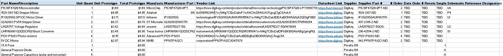

## Overview
This page contains the bill of materials for this project 

<html xmlns:v="urn:schemas-microsoft-com:vml"
xmlns:o="urn:schemas-microsoft-com:office:office"
xmlns:x="urn:schemas-microsoft-com:office:excel"
xmlns="http://www.w3.org/TR/REC-html40">

<head>
<meta http-equiv=Content-Type content="text/html; charset=windows-1252">
<meta name=ProgId content=Excel.Sheet>
<meta name=Generator content="Microsoft Excel 15">
<link id=Main-File rel=Main-File
href="../Bill%20of%20Materials%20Solar%20Actuator.htm">
<link rel=File-List href=filelist.xml>
<link rel=Stylesheet href=stylesheet.css>

<![if !supportTabStrip]>
<![endif]>
</head>

<body link="#0563C1" vlink="#954F72">

<table border=0 cellpadding=0 cellspacing=0 width=2262 style='border-collapse:
 collapse;table-layout:fixed;width:1697pt'>
 <col width=341 style='mso-width-source:userset;mso-width-alt:12117;width:256pt'>
 <col width=80 style='mso-width-source:userset;mso-width-alt:2844;width:60pt'>
 <col width=116 style='mso-width-source:userset;mso-width-alt:4124;width:87pt'>
 <col width=122 style='mso-width-source:userset;mso-width-alt:4323;width:91pt'>
 <col width=80 style='mso-width-source:userset;mso-width-alt:2844;width:60pt'>
 <col width=146 style='mso-width-source:userset;mso-width-alt:5205;width:110pt'>
 <col width=553 style='mso-width-source:userset;mso-width-alt:19655;width:415pt'>
 <col width=116 style='mso-width-source:userset;mso-width-alt:4124;width:87pt'>
 <col width=66 style='mso-width-source:userset;mso-width-alt:2360;width:50pt'>
 <col width=144 style='mso-width-source:userset;mso-width-alt:5120;width:108pt'>
 <col width=61 style='mso-width-source:userset;mso-width-alt:2161;width:46pt'>
 <col width=80 style='mso-width-source:userset;mso-width-alt:2844;width:60pt'>
 <col width=67 style='mso-width-source:userset;mso-width-alt:2389;width:50pt'>
 <col width=50 style='mso-width-source:userset;mso-width-alt:1763;width:37pt'>
 <col width=240 style='mso-width-source:userset;mso-width-alt:8533;width:180pt'>
 <tr height=21 style='mso-height-source:userset;height:15.75pt'>
  <td colspan=15 height=21 class=xl77 width=2262 style='height:15.75pt;
  width:1697pt'>Bill of Materials Solar Actuator</td>
 </tr>
 <tr height=21 style='mso-height-source:userset;height:15.75pt'>
  <td height=21 class=xl65 style='height:15.75pt'>Part Name/Description</td>
  <td class=xl65>Unit Quantity</td>
  <td class=xl65>Unit Prototype Cost</td>
  <td class=xl65>Total Prototype Cost</td>
  <td class=xl65>Manufacturer</td>
  <td class=xl65>Manufacturer Part #</td>
  <td class=xl65>Vendor Link</td>
  <td class=xl65>Datasheet Link</td>
  <td class=xl65>Supplier</td>
  <td class=xl65>Supplier Part #</td>
  <td class=xl65># Ordered</td>
  <td class=xl65>Date Ordered</td>
  <td class=xl65># Received</td>
  <td class=xl65>Surplus</td>
  <td class=xl65>Schematic Reference Designators</td>
 </tr>
 <tr height=21 style='mso-height-source:userset;height:15.75pt'>
  <td height=21 class=xl66 style='height:15.75pt'>PIC18F47Q10 Microcontroller</td>
  <td class=xl67 align=right>1</td>
  <td class=xl68 align=right>$1.49</td>
  <td class=xl68 align=right>$1.49</td>
  <td class=xl66>MicroChip</td>
  <td class=xl66>PIC18F47Q10-I/PT</td>
  <td>https://www.digikey.com/en/products/detail/microchip-technology/PIC18F47Q10-I-PT/10187786</td>
  <td class=xl70><a
  href="https://ww1.microchip.com/downloads/en/DeviceDoc/PIC18F27-47Q10-Data-Sheet-40002043E.pdf"
  target="_parent">https://ww1.microchip.com/downloads/en/DeviceDoc/PIC18F27-47Q10-Data-Sheet-40002043E.pdf</a></td>
  <td class=xl66>Digikey</td>
  <td class=xl66>PIC18F47Q10-I/PT-ND</td>
  <td class=xl66 align=right>2</td>
  <td class=xl69>TBD</td>
  <td class=xl66>TBD</td>
  <td class=xl67>TBD</td>
  <td class=xl66>U4</td>
 </tr>
 <tr height=21 style='mso-height-source:userset;height:15.75pt'>
  <td height=21 class=xl66 style='height:15.75pt'>1528-1367-ND Stepper Motor</td>
  <td class=xl67 align=right>1</td>
  <td class=xl68 align=right>$4.95</td>
  <td class=xl68 align=right>$4.95</td>
  <td class=xl72>Adafruit</td>
  <td class=xl66 align=right>918</td>
  <td class=xl71 width=553 style='width:415pt'>https://www.digikey.com/en/products/detail/adafruit-industries-llc/918/5629415?s=N4IgTCBcDaIIwFYwA4C0cDMA2A7KgcgCIgC6AvkA</td>
  <td class=xl70><a
  href="https://mm.digikey.com/Volume0/opasdata/d220001/medias/docus/1861/918_Web.pdf"
  target="_parent">https://mm.digikey.com/Volume0/opasdata/d220001/medias/docus/1861/918_Web.pdf</a></td>
  <td class=xl72>Digikey</td>
  <td class=xl72>1528-1367-ND</td>
  <td class=xl66 align=right>1</td>
  <td class=xl73>TBD</td>
  <td class=xl72>TBD</td>
  <td class=xl72>TBD</td>
  <td class=xl72>P4</td>
 </tr>
 <tr height=21 style='mso-height-source:userset;height:15.75pt'>
  <td height=21 class=xl72 style='height:15.75pt'>IFX9201SG SPI DC Motor Driver</td>
  <td class=xl67 align=right>3</td>
  <td class=xl68 align=right>$3.71</td>
  <td class=xl68 align=right>$11.13</td>
  <td class=xl72>Infineon</td>
  <td class=xl72>IFX9201SG</td>
  <td class=xl71 width=553 style='width:415pt'>https://www.digikey.com/en/products/detail/infineon-technologies/IFX9201SGAUMA1/5415542?s=N4IgTCBcDaIJIDEAaBOMAGAjAZQOIgF0BfIA</td>
  <td class=xl70><a
  href="https://www.infineon.com/dgdl/Infineon-IFX9201SG-DS-v01_01-EN.pdf?fileId=5546d4624cb7f111014d2e8916795dea&amp;ack=t"
  target="_parent">https://www.infineon.com/dgdl/Infineon-IFX9201SG-DS-v01_01-EN.pdf?fileId=5546d4624cb7f111014d2e8916795dea&amp;ack=t</a></td>
  <td class=xl72>Digikey</td>
  <td class=xl74 width=144 style='width:108pt'>	 
    IFX9201SGAUMA1TR-ND</td>
  <td class=xl66 align=right>3</td>
  <td class=xl73>TBD</td>
  <td class=xl72>TBD</td>
  <td class=xl72>TBD</td>
  <td class=xl72>U1</td>
 </tr>
 <tr height=21 style='mso-height-source:userset;height:15.75pt'>
  <td height=21 class=xl72 style='height:15.75pt'>ULN2003 PWM Stepper Driver</td>
  <td class=xl67 align=right>2</td>
  <td class=xl68 align=right>$0.37</td>
  <td class=xl68 align=right>$0.74</td>
  <td class=xl72>ST Microelectronics</td>
  <td class=xl74 width=146 style='width:110pt'>	 
    ULN2003D1013TR</td>
  <td>https://www.digikey.com/en/products/detail/stmicroelectronics/ULN2003D1013TR/599284</td>
  <td class=xl70><a
  href="https://www.st.com/content/ccc/resource/technical/document/datasheet/f3/6e/c8/64/4d/b3/4e/38/CD00001244.pdf/files/CD00001244.pdf/jcr:content/translations/en.CD00001244.pdf"
  target="_parent">https://www.st.com/content/ccc/resource/technical/document/datasheet/f3/6e/c8/64/4d/b3/4e/38/CD00001244.pdf/files/CD00001244.pdf/jcr:content/translations/en.CD00001244.pdf</a></td>
  <td class=xl72>Digikey</td>
  <td class=xl72>497-2345-2-ND</td>
  <td class=xl66 align=right>2</td>
  <td class=xl73>TBD</td>
  <td class=xl72>TDB</td>
  <td class=xl72>TBD</td>
  <td class=xl66></td>
 </tr>
 <tr height=21 style='mso-height-source:userset;height:15.75pt'>
  <td height=21 class=xl72 style='height:15.75pt'>LM2575T Voltage Regulator</td>
  <td class=xl67 align=right>2</td>
  <td class=xl68 align=right>$3.42</td>
  <td class=xl68 align=right>$6.84</td>
  <td class=xl72>onsemi</td>
  <td class=xl74 width=146 style='width:110pt'>	 
    LM2575D2T-5G</td>
  <td>https://www.digikey.com/en/products/detail/onsemi/LM2575D2T-5G/1476689</td>
  <td class=xl70><a href="https://www.onsemi.com/pdf/datasheet/lm2575-d.pdf"
  target="_parent">https://www.onsemi.com/pdf/datasheet/lm2575-d.pdf</a></td>
  <td class=xl72>Digikey</td>
  <td class=xl74 width=144 style='width:108pt'>	 
    LM2575D2T-5GOS-ND</td>
  <td class=xl66 align=right>2</td>
  <td class=xl73>TBD</td>
  <td class=xl72>TBD</td>
  <td class=xl72>TBD</td>
  <td class=xl72>U3</td>
 </tr>
 <tr height=21 style='mso-height-source:userset;height:15.75pt'>
  <td height=21 class=xl72 style='height:15.75pt'>LMR16006YQ3DDCRQ1 Buck
  Converter</td>
  <td class=xl67 align=right>2</td>
  <td class=xl68 align=right>$3.49</td>
  <td class=xl68 align=right>$6.98</td>
  <td class=xl72>Texas Instruments</td>
  <td class=xl72>LMR16006YQ3DDCRQ1</td>
  <td class=xl71 width=553 style='width:415pt'>https://www.digikey.com/en/products/detail/texas-instruments/LMR16006YQ3DDCRQ1/5395814?s=N4IgTCBcDaIDIFkBKBGAbABg2gmgRQGYARIgYSTxRAF0BfIA</td>
  <td class=xl70><a
  href="https://www.ti.com/general/docs/suppproductinfo.tsp?distId=10&amp;gotoUrl=https%3A%2F%2Fwww.ti.com%2Flit%2Fgpn%2Flmr16006y-q1"
  target="_parent">https://www.ti.com/general/docs/suppproductinfo.tsp?distId=10&amp;gotoUrl=https%3A%2F%2Fwww.ti.com%2Flit%2Fgpn%2Flmr16006y-q1</a></td>
  <td class=xl72>Digikey</td>
  <td class=xl74 width=144 style='width:108pt'>	 
    296-42514-2-ND</td>
  <td class=xl66 align=right>2</td>
  <td class=xl73>TBD</td>
  <td class=xl72>TBD</td>
  <td class=xl72>TBD</td>
  <td class=xl66>S1</td>
 </tr>
 <tr height=21 style='mso-height-source:userset;height:15.75pt'>
  <td height=21 class=xl72 style='height:15.75pt'>PDV-P9203 Photo-resistor</td>
  <td class=xl67 align=right>4</td>
  <td class=xl68 align=right>$1.15</td>
  <td class=xl68 align=right>$4.60</td>
  <td class=xl72>Advanced Photonix</td>
  <td class=xl72>PDV-P9203</td>
  <td class=xl71 width=553 style='width:415pt'>https://www.digikey.com/en/products/detail/advanced-photonix/PDV-P9203/480628?s=N4IgTCBcDaIAoBEBqBaOBOMAGAzCAugL5A</td>
  <td class=xl70><a
  href="https://www.advancedphotonix.com/wp-content/uploads/2015/07/DS-PDV-P9203.pdf"
  target="_parent">https://www.advancedphotonix.com/wp-content/uploads/2015/07/DS-PDV-P9203.pdf</a></td>
  <td class=xl72>Digikey</td>
  <td class=xl74 width=144 style='width:108pt'>	 
    PDV-P9203-ND</td>
  <td class=xl66 align=right>4</td>
  <td class=xl73>TBD</td>
  <td class=xl72>TBD</td>
  <td class=xl72>TBD</td>
  <td class=xl66></td>
 </tr>
 <tr height=21 style='mso-height-source:userset;height:15.75pt'>
  <td height=21 class=xl72 style='height:15.75pt'>5V DC Motor</td>
  <td class=xl67 align=right>2</td>
  <td class=xl68 align=right>$2.97</td>
  <td class=xl68 align=right>$5.94</td>
  <td class=xl75 width=80 style='width:60pt'>	 
    NMB Technologies Corporation</td>
  <td class=xl72>PPN7PA12C1</td>
  <td class=xl71 width=553 style='width:415pt'>https://www.digikey.com/en/products/detail/nmb-technologies-corporation/PPN7PA12C1/2417079</td>
  <td class=xl70><a
  href="https://mm.digikey.com/Volume0/opasdata/d220001/medias/docus/6448/ppn7%20Datasheet.pdf"
  target="_parent">https://mm.digikey.com/Volume0/opasdata/d220001/medias/docus/6448/ppn7%20Datasheet.pdf</a></td>
  <td class=xl72>Digikey</td>
  <td class=xl75 width=144 style='width:108pt'>	 
    942-PPN7PA12C1-ND</td>
  <td class=xl72 align=right>2</td>
  <td class=xl73>TBD</td>
  <td class=xl72>TBD</td>
  <td class=xl76>TBD</td>
  <td></td>
 </tr>
 <tr height=21 style='mso-height-source:userset;height:15.75pt'>
  <td height=21 class=xl72 style='height:15.75pt'>1.5 A Fuse</td>
  <td class=xl67 align=right>1</td>
  <td class=xl68></td>
  <td class=xl68 align=right>$0.00</td>
  <td colspan=4 style='mso-ignore:colspan'></td>
  <td class=xl72>Peralta 109</td>
  <td colspan=2 style='mso-ignore:colspan'></td>
  <td class=xl69></td>
  <td></td>
  <td class=xl67 align=right>-1</td>
  <td></td>
 </tr>
 <tr height=21 style='mso-height-source:userset;height:15.75pt'>
  <td height=21 class=xl72 style='height:15.75pt'>General Purpose Diode</td>
  <td class=xl67 align=right>4</td>
  <td class=xl68></td>
  <td class=xl68 align=right>$0.00</td>
  <td colspan=4 style='mso-ignore:colspan'></td>
  <td class=xl72>Peralta 109</td>
  <td colspan=2 style='mso-ignore:colspan'></td>
  <td class=xl69></td>
  <td></td>
  <td class=xl67 align=right>-4</td>
  <td></td>
 </tr>
 <tr height=21 style='mso-height-source:userset;height:15.75pt'>
  <td height=21 class=xl66 style='height:15.75pt'>General Purpose Capacitors
  (polar and non-polar)</td>
  <td class=xl67 align=right>4</td>
  <td class=xl68></td>
  <td class=xl68 align=right>$0.00</td>
  <td colspan=4 style='mso-ignore:colspan'></td>
  <td class=xl72>Peralta 109</td>
  <td colspan=2 style='mso-ignore:colspan'></td>
  <td class=xl69></td>
  <td></td>
  <td class=xl67 align=right>-4</td>
  <td></td>
 </tr>
 <tr height=21 style='mso-height-source:userset;height:15.75pt'>
  <td height=21 style='height:15.75pt'></td>
  <td class=xl67></td>
  <td class=xl68></td>
  <td class=xl68 align=right>$0.00</td>
  <td colspan=7 style='mso-ignore:colspan'></td>
  <td class=xl69></td>
  <td></td>
  <td class=xl67 align=right>0</td>
  <td></td>
 </tr>
 <tr height=21 style='mso-height-source:userset;height:15.75pt'>
  <td height=21 style='height:15.75pt'></td>
  <td class=xl67></td>
  <td class=xl68></td>
  <td class=xl68 align=right>$0.00</td>
  <td colspan=7 style='mso-ignore:colspan'></td>
  <td class=xl69></td>
  <td></td>
  <td class=xl67 align=right>0</td>
  <td></td>
 </tr>
 <tr height=21 style='mso-height-source:userset;height:15.75pt'>
  <td height=21 style='height:15.75pt'></td>
  <td class=xl67></td>
  <td class=xl68></td>
  <td class=xl68 align=right>$0.00</td>
  <td colspan=7 style='mso-ignore:colspan'></td>
  <td class=xl69></td>
  <td></td>
  <td class=xl67 align=right>0</td>
  <td></td>
 </tr>
 <tr height=21 style='mso-height-source:userset;height:15.75pt'>
  <td height=21 style='height:15.75pt'></td>
  <td class=xl67></td>
  <td class=xl68></td>
  <td class=xl68 align=right>$0.00</td>
  <td colspan=7 style='mso-ignore:colspan'></td>
  <td class=xl69></td>
  <td></td>
  <td class=xl67 align=right>0</td>
  <td></td>
 </tr>
 <tr height=21 style='mso-height-source:userset;height:15.75pt'>
  <td height=21 style='height:15.75pt'></td>
  <td class=xl67></td>
  <td class=xl68></td>
  <td class=xl68 align=right>$0.00</td>
  <td colspan=7 style='mso-ignore:colspan'></td>
  <td class=xl69></td>
  <td></td>
  <td class=xl67 align=right>0</td>
  <td></td>
 </tr>
 <tr height=21 style='mso-height-source:userset;height:15.75pt'>
  <td height=21 style='height:15.75pt'></td>
  <td class=xl67></td>
  <td class=xl68></td>
  <td class=xl68 align=right>$0.00</td>
  <td colspan=7 style='mso-ignore:colspan'></td>
  <td class=xl69></td>
  <td></td>
  <td class=xl67 align=right>0</td>
  <td></td>
 </tr>
 <tr height=21 style='mso-height-source:userset;height:15.75pt'>
  <td height=21 style='height:15.75pt'></td>
  <td class=xl67></td>
  <td class=xl68></td>
  <td class=xl68 align=right>$0.00</td>
  <td colspan=7 style='mso-ignore:colspan'></td>
  <td class=xl69></td>
  <td></td>
  <td class=xl67 align=right>0</td>
  <td></td>
 </tr>
 <tr height=21 style='mso-height-source:userset;height:15.75pt'>
  <td height=21 style='height:15.75pt'></td>
  <td class=xl67></td>
  <td class=xl68></td>
  <td class=xl68 align=right>$0.00</td>
  <td colspan=7 style='mso-ignore:colspan'></td>
  <td class=xl69></td>
  <td></td>
  <td class=xl67 align=right>0</td>
  <td></td>
 </tr>
 <tr height=21 style='mso-height-source:userset;height:15.75pt'>
  <td height=21 style='height:15.75pt'></td>
  <td class=xl67></td>
  <td class=xl68></td>
  <td class=xl68 align=right>$0.00</td>
  <td colspan=7 style='mso-ignore:colspan'></td>
  <td class=xl69></td>
  <td></td>
  <td class=xl67 align=right>0</td>
  <td></td>
 </tr>
 <tr height=21 style='mso-height-source:userset;height:15.75pt'>
  <td height=21 style='height:15.75pt'></td>
  <td class=xl67></td>
  <td class=xl68></td>
  <td class=xl68 align=right>$0.00</td>
  <td colspan=7 style='mso-ignore:colspan'></td>
  <td class=xl69></td>
  <td></td>
  <td class=xl67 align=right>0</td>
  <td></td>
 </tr>
 <tr height=21 style='mso-height-source:userset;height:15.75pt'>
  <td height=21 style='height:15.75pt'></td>
  <td class=xl67></td>
  <td class=xl68></td>
  <td class=xl68 align=right>$0.00</td>
  <td colspan=7 style='mso-ignore:colspan'></td>
  <td class=xl69></td>
  <td></td>
  <td class=xl67 align=right>0</td>
  <td></td>
 </tr>
 <tr height=21 style='mso-height-source:userset;height:15.75pt'>
  <td height=21 style='height:15.75pt'></td>
  <td class=xl67></td>
  <td class=xl68></td>
  <td class=xl68 align=right>$0.00</td>
  <td colspan=7 style='mso-ignore:colspan'></td>
  <td class=xl69></td>
  <td></td>
  <td class=xl67 align=right>0</td>
  <td></td>
 </tr>
 <tr height=21 style='mso-height-source:userset;height:15.75pt'>
  <td height=21 style='height:15.75pt'></td>
  <td class=xl67></td>
  <td class=xl68></td>
  <td class=xl68 align=right>$0.00</td>
  <td colspan=7 style='mso-ignore:colspan'></td>
  <td class=xl69></td>
  <td></td>
  <td class=xl67 align=right>0</td>
  <td></td>
 </tr>
 <tr height=21 style='mso-height-source:userset;height:15.75pt'>
  <td height=21 style='height:15.75pt'></td>
  <td class=xl67></td>
  <td class=xl68></td>
  <td class=xl68 align=right>$0.00</td>
  <td colspan=7 style='mso-ignore:colspan'></td>
  <td class=xl69></td>
  <td></td>
  <td class=xl67 align=right>0</td>
  <td></td>
 </tr>
 <tr height=21 style='mso-height-source:userset;height:15.75pt'>
  <td height=21 style='height:15.75pt'></td>
  <td class=xl67></td>
  <td class=xl68></td>
  <td class=xl68 align=right>$0.00</td>
  <td colspan=7 style='mso-ignore:colspan'></td>
  <td class=xl69></td>
  <td></td>
  <td class=xl67 align=right>0</td>
  <td></td>
 </tr>
 <tr height=21 style='mso-height-source:userset;height:15.75pt'>
  <td height=21 style='height:15.75pt'></td>
  <td class=xl67></td>
  <td class=xl68></td>
  <td class=xl68 align=right>$0.00</td>
  <td colspan=7 style='mso-ignore:colspan'></td>
  <td class=xl69></td>
  <td></td>
  <td class=xl67 align=right>0</td>
  <td></td>
 </tr>
 <tr height=21 style='mso-height-source:userset;height:15.75pt'>
  <td height=21 style='height:15.75pt'></td>
  <td class=xl67></td>
  <td class=xl68></td>
  <td class=xl68 align=right>$0.00</td>
  <td colspan=7 style='mso-ignore:colspan'></td>
  <td class=xl69></td>
  <td></td>
  <td class=xl67 align=right>0</td>
  <td></td>
 </tr>
 <tr height=21 style='mso-height-source:userset;height:15.75pt'>
  <td height=21 style='height:15.75pt'></td>
  <td class=xl67></td>
  <td class=xl68></td>
  <td class=xl68 align=right>$0.00</td>
  <td colspan=7 style='mso-ignore:colspan'></td>
  <td class=xl69></td>
  <td></td>
  <td class=xl67 align=right>0</td>
  <td></td>
 </tr>
 <tr height=21 style='mso-height-source:userset;height:15.75pt'>
  <td height=21 style='height:15.75pt'></td>
  <td class=xl67></td>
  <td class=xl68></td>
  <td class=xl68 align=right>$0.00</td>
  <td colspan=7 style='mso-ignore:colspan'></td>
  <td class=xl69></td>
  <td></td>
  <td class=xl67 align=right>0</td>
  <td></td>
 </tr>
 <tr height=21 style='mso-height-source:userset;height:15.75pt'>
  <td height=21 style='height:15.75pt'></td>
  <td class=xl67></td>
  <td class=xl68></td>
  <td class=xl68 align=right>$0.00</td>
  <td colspan=7 style='mso-ignore:colspan'></td>
  <td class=xl69></td>
  <td></td>
  <td class=xl67 align=right>0</td>
  <td></td>
 </tr>
 <tr height=21 style='mso-height-source:userset;height:15.75pt'>
  <td height=21 style='height:15.75pt'></td>
  <td class=xl67></td>
  <td class=xl68></td>
  <td class=xl68 align=right>$0.00</td>
  <td colspan=7 style='mso-ignore:colspan'></td>
  <td class=xl69></td>
  <td></td>
  <td class=xl67 align=right>0</td>
  <td></td>
 </tr>
 <tr height=21 style='mso-height-source:userset;height:15.75pt'>
  <td height=21 style='height:15.75pt'></td>
  <td class=xl67></td>
  <td class=xl68></td>
  <td class=xl68 align=right>$0.00</td>
  <td colspan=7 style='mso-ignore:colspan'></td>
  <td class=xl69></td>
  <td></td>
  <td class=xl67 align=right>0</td>
  <td></td>
 </tr>
 <tr height=21 style='mso-height-source:userset;height:15.75pt'>
  <td height=21 style='height:15.75pt'></td>
  <td class=xl67></td>
  <td class=xl68></td>
  <td class=xl68 align=right>$0.00</td>
  <td colspan=7 style='mso-ignore:colspan'></td>
  <td class=xl69></td>
  <td></td>
  <td class=xl67 align=right>0</td>
  <td></td>
 </tr>
 <tr height=21 style='mso-height-source:userset;height:15.75pt'>
  <td height=21 style='height:15.75pt'></td>
  <td class=xl67></td>
  <td class=xl68></td>
  <td class=xl68 align=right>$0.00</td>
  <td colspan=7 style='mso-ignore:colspan'></td>
  <td class=xl69></td>
  <td></td>
  <td class=xl67 align=right>0</td>
  <td></td>
 </tr>
 <tr height=18 style='height:13.2pt'>
  <td height=18 style='height:13.2pt'></td>
  <td class=xl67></td>
  <td class=xl68></td>
  <td class=xl68 align=right>$0.00</td>
  <td colspan=7 style='mso-ignore:colspan'></td>
  <td class=xl69></td>
  <td></td>
  <td class=xl67 align=right>0</td>
  <td></td>
 </tr>
 <tr height=18 style='height:13.2pt'>
  <td height=18 style='height:13.2pt'></td>
  <td class=xl67></td>
  <td class=xl68></td>
  <td class=xl68 align=right>$0.00</td>
  <td colspan=7 style='mso-ignore:colspan'></td>
  <td class=xl69></td>
  <td></td>
  <td class=xl67 align=right>0</td>
  <td></td>
 </tr>
 <tr height=18 style='height:13.2pt'>
  <td height=18 style='height:13.2pt'></td>
  <td class=xl67></td>
  <td class=xl68></td>
  <td class=xl68 align=right>$0.00</td>
  <td colspan=7 style='mso-ignore:colspan'></td>
  <td class=xl69></td>
  <td></td>
  <td class=xl67 align=right>0</td>
  <td></td>
 </tr>
 <tr height=18 style='height:13.2pt'>
  <td height=18 style='height:13.2pt'></td>
  <td class=xl67></td>
  <td class=xl68></td>
  <td class=xl68 align=right>$0.00</td>
  <td colspan=7 style='mso-ignore:colspan'></td>
  <td class=xl69></td>
  <td></td>
  <td class=xl67 align=right>0</td>
  <td></td>
 </tr>
 <tr height=18 style='height:13.2pt'>
  <td height=18 style='height:13.2pt'></td>
  <td class=xl67></td>
  <td class=xl68></td>
  <td class=xl68 align=right>$0.00</td>
  <td colspan=7 style='mso-ignore:colspan'></td>
  <td class=xl69></td>
  <td></td>
  <td class=xl67 align=right>0</td>
  <td></td>
 </tr>
 <tr height=18 style='height:13.2pt'>
  <td height=18 style='height:13.2pt'></td>
  <td class=xl67></td>
  <td class=xl68></td>
  <td class=xl68 align=right>$0.00</td>
  <td colspan=7 style='mso-ignore:colspan'></td>
  <td class=xl69></td>
  <td></td>
  <td class=xl67 align=right>0</td>
  <td></td>
 </tr>
 <tr height=18 style='height:13.2pt'>
  <td height=18 style='height:13.2pt'></td>
  <td class=xl67></td>
  <td class=xl68></td>
  <td class=xl68 align=right>$0.00</td>
  <td colspan=7 style='mso-ignore:colspan'></td>
  <td class=xl69></td>
  <td></td>
  <td class=xl67 align=right>0</td>
  <td></td>
 </tr>
 <tr height=18 style='height:13.2pt'>
  <td height=18 style='height:13.2pt'></td>
  <td class=xl67></td>
  <td class=xl68></td>
  <td class=xl68 align=right>$0.00</td>
  <td colspan=7 style='mso-ignore:colspan'></td>
  <td class=xl69></td>
  <td></td>
  <td class=xl67 align=right>0</td>
  <td></td>
 </tr>
 <tr height=18 style='height:13.2pt'>
  <td height=18 style='height:13.2pt'></td>
  <td class=xl67></td>
  <td class=xl68></td>
  <td class=xl68 align=right>$0.00</td>
  <td colspan=7 style='mso-ignore:colspan'></td>
  <td class=xl69></td>
  <td></td>
  <td class=xl67 align=right>0</td>
  <td></td>
 </tr>
 <tr height=18 style='height:13.2pt'>
  <td height=18 style='height:13.2pt'></td>
  <td class=xl67></td>
  <td class=xl68></td>
  <td class=xl68 align=right>$0.00</td>
  <td colspan=7 style='mso-ignore:colspan'></td>
  <td class=xl69></td>
  <td></td>
  <td class=xl67 align=right>0</td>
  <td></td>
 </tr>
 <tr height=18 style='height:13.2pt'>
  <td height=18 style='height:13.2pt'></td>
  <td class=xl67></td>
  <td class=xl68></td>
  <td class=xl68 align=right>$0.00</td>
  <td colspan=7 style='mso-ignore:colspan'></td>
  <td class=xl69></td>
  <td></td>
  <td class=xl67 align=right>0</td>
  <td></td>
 </tr>
 <tr height=18 style='height:13.2pt'>
  <td height=18 style='height:13.2pt'></td>
  <td class=xl67></td>
  <td class=xl68></td>
  <td class=xl68 align=right>$0.00</td>
  <td colspan=7 style='mso-ignore:colspan'></td>
  <td class=xl69></td>
  <td></td>
  <td class=xl67 align=right>0</td>
  <td></td>
 </tr>
 <tr height=18 style='height:13.2pt'>
  <td height=18 style='height:13.2pt'></td>
  <td class=xl67></td>
  <td class=xl68></td>
  <td class=xl68 align=right>$0.00</td>
  <td colspan=7 style='mso-ignore:colspan'></td>
  <td class=xl69></td>
  <td></td>
  <td class=xl67 align=right>0</td>
  <td></td>
 </tr>
 <tr height=18 style='height:13.2pt'>
  <td height=18 style='height:13.2pt'></td>
  <td class=xl67></td>
  <td class=xl68></td>
  <td class=xl68 align=right>$0.00</td>
  <td colspan=7 style='mso-ignore:colspan'></td>
  <td class=xl69></td>
  <td></td>
  <td class=xl67 align=right>0</td>
  <td></td>
 </tr>
 <tr height=18 style='height:13.2pt'>
  <td height=18 style='height:13.2pt'></td>
  <td class=xl67></td>
  <td class=xl68></td>
  <td class=xl68 align=right>$0.00</td>
  <td colspan=7 style='mso-ignore:colspan'></td>
  <td class=xl69></td>
  <td></td>
  <td class=xl67 align=right>0</td>
  <td></td>
 </tr>
 <tr height=18 style='height:13.2pt'>
  <td height=18 style='height:13.2pt'></td>
  <td class=xl67></td>
  <td class=xl68></td>
  <td class=xl68 align=right>$0.00</td>
  <td colspan=7 style='mso-ignore:colspan'></td>
  <td class=xl69></td>
  <td></td>
  <td class=xl67 align=right>0</td>
  <td></td>
 </tr>
 <tr height=18 style='height:13.2pt'>
  <td height=18 style='height:13.2pt'></td>
  <td class=xl67></td>
  <td class=xl68></td>
  <td class=xl68 align=right>$0.00</td>
  <td colspan=7 style='mso-ignore:colspan'></td>
  <td class=xl69></td>
  <td></td>
  <td class=xl67 align=right>0</td>
  <td></td>
 </tr>
 <tr height=18 style='height:13.2pt'>
  <td height=18 style='height:13.2pt'></td>
  <td class=xl67></td>
  <td class=xl68></td>
  <td class=xl68 align=right>$0.00</td>
  <td colspan=7 style='mso-ignore:colspan'></td>
  <td class=xl69></td>
  <td></td>
  <td class=xl67 align=right>0</td>
  <td></td>
 </tr>
 <tr height=18 style='height:13.2pt'>
  <td height=18 style='height:13.2pt'></td>
  <td class=xl67></td>
  <td class=xl68></td>
  <td class=xl68 align=right>$0.00</td>
  <td colspan=7 style='mso-ignore:colspan'></td>
  <td class=xl69></td>
  <td></td>
  <td class=xl67 align=right>0</td>
  <td></td>
 </tr>
 <tr height=18 style='height:13.2pt'>
  <td height=18 style='height:13.2pt'></td>
  <td class=xl67></td>
  <td class=xl68></td>
  <td class=xl68 align=right>$0.00</td>
  <td colspan=7 style='mso-ignore:colspan'></td>
  <td class=xl69></td>
  <td></td>
  <td class=xl67 align=right>0</td>
  <td></td>
 </tr>
 <tr height=18 style='height:13.2pt'>
  <td height=18 style='height:13.2pt'></td>
  <td class=xl67></td>
  <td class=xl68></td>
  <td class=xl68 align=right>$0.00</td>
  <td colspan=7 style='mso-ignore:colspan'></td>
  <td class=xl69></td>
  <td></td>
  <td class=xl67 align=right>0</td>
  <td></td>
 </tr>
 <tr height=18 style='height:13.2pt'>
  <td height=18 style='height:13.2pt'></td>
  <td class=xl67></td>
  <td class=xl68></td>
  <td class=xl68 align=right>$0.00</td>
  <td colspan=7 style='mso-ignore:colspan'></td>
  <td class=xl69></td>
  <td></td>
  <td class=xl67 align=right>0</td>
  <td></td>
 </tr>
 <tr height=18 style='height:13.2pt'>
  <td height=18 style='height:13.2pt'></td>
  <td class=xl67></td>
  <td class=xl68></td>
  <td class=xl68 align=right>$0.00</td>
  <td colspan=7 style='mso-ignore:colspan'></td>
  <td class=xl69></td>
  <td></td>
  <td class=xl67 align=right>0</td>
  <td></td>
 </tr>
 <tr height=18 style='height:13.2pt'>
  <td height=18 style='height:13.2pt'></td>
  <td class=xl67></td>
  <td class=xl68></td>
  <td class=xl68 align=right>$0.00</td>
  <td colspan=7 style='mso-ignore:colspan'></td>
  <td class=xl69></td>
  <td></td>
  <td class=xl67 align=right>0</td>
  <td></td>
 </tr>
 <tr height=18 style='height:13.2pt'>
  <td height=18 style='height:13.2pt'></td>
  <td class=xl67></td>
  <td class=xl68></td>
  <td class=xl68 align=right>$0.00</td>
  <td colspan=7 style='mso-ignore:colspan'></td>
  <td class=xl69></td>
  <td></td>
  <td class=xl67 align=right>0</td>
  <td></td>
 </tr>
 <tr height=18 style='height:13.2pt'>
  <td height=18 style='height:13.2pt'></td>
  <td class=xl67></td>
  <td class=xl68></td>
  <td class=xl68 align=right>$0.00</td>
  <td colspan=7 style='mso-ignore:colspan'></td>
  <td class=xl69></td>
  <td></td>
  <td class=xl67 align=right>0</td>
  <td></td>
 </tr>
 <tr height=18 style='height:13.2pt'>
  <td height=18 style='height:13.2pt'></td>
  <td class=xl67></td>
  <td class=xl68></td>
  <td class=xl68 align=right>$0.00</td>
  <td colspan=7 style='mso-ignore:colspan'></td>
  <td class=xl69></td>
  <td></td>
  <td class=xl67 align=right>0</td>
  <td></td>
 </tr>
 <tr height=18 style='height:13.2pt'>
  <td height=18 style='height:13.2pt'></td>
  <td class=xl67></td>
  <td class=xl68></td>
  <td class=xl68 align=right>$0.00</td>
  <td colspan=7 style='mso-ignore:colspan'></td>
  <td class=xl69></td>
  <td></td>
  <td class=xl67 align=right>0</td>
  <td></td>
 </tr>
 <tr height=18 style='height:13.2pt'>
  <td height=18 style='height:13.2pt'></td>
  <td class=xl67></td>
  <td class=xl68></td>
  <td class=xl68 align=right>$0.00</td>
  <td colspan=7 style='mso-ignore:colspan'></td>
  <td class=xl69></td>
  <td></td>
  <td class=xl67 align=right>0</td>
  <td></td>
 </tr>
 <tr height=18 style='height:13.2pt'>
  <td height=18 style='height:13.2pt'></td>
  <td class=xl67></td>
  <td class=xl68></td>
  <td class=xl68 align=right>$0.00</td>
  <td colspan=7 style='mso-ignore:colspan'></td>
  <td class=xl69></td>
  <td></td>
  <td class=xl67 align=right>0</td>
  <td></td>
 </tr>
 <tr height=18 style='height:13.2pt'>
  <td height=18 style='height:13.2pt'></td>
  <td class=xl67></td>
  <td class=xl68></td>
  <td class=xl68 align=right>$0.00</td>
  <td colspan=7 style='mso-ignore:colspan'></td>
  <td class=xl69></td>
  <td></td>
  <td class=xl67 align=right>0</td>
  <td></td>
 </tr>
 <tr height=18 style='height:13.2pt'>
  <td height=18 style='height:13.2pt'></td>
  <td class=xl67></td>
  <td class=xl68></td>
  <td class=xl68 align=right>$0.00</td>
  <td colspan=7 style='mso-ignore:colspan'></td>
  <td class=xl69></td>
  <td></td>
  <td class=xl67 align=right>0</td>
  <td></td>
 </tr>
 <tr height=18 style='height:13.2pt'>
  <td height=18 style='height:13.2pt'></td>
  <td class=xl67></td>
  <td class=xl68></td>
  <td class=xl68 align=right>$0.00</td>
  <td colspan=7 style='mso-ignore:colspan'></td>
  <td class=xl69></td>
  <td></td>
  <td class=xl67 align=right>0</td>
  <td></td>
 </tr>
 <tr height=18 style='height:13.2pt'>
  <td height=18 style='height:13.2pt'></td>
  <td class=xl67></td>
  <td class=xl68></td>
  <td class=xl68 align=right>$0.00</td>
  <td colspan=7 style='mso-ignore:colspan'></td>
  <td class=xl69></td>
  <td></td>
  <td class=xl67 align=right>0</td>
  <td></td>
 </tr>
 <tr height=18 style='height:13.2pt'>
  <td height=18 style='height:13.2pt'></td>
  <td class=xl67></td>
  <td class=xl68></td>
  <td class=xl68 align=right>$0.00</td>
  <td colspan=7 style='mso-ignore:colspan'></td>
  <td class=xl69></td>
  <td></td>
  <td class=xl67 align=right>0</td>
  <td></td>
 </tr>
 <tr height=18 style='height:13.2pt'>
  <td height=18 style='height:13.2pt'></td>
  <td class=xl67></td>
  <td class=xl68></td>
  <td class=xl68 align=right>$0.00</td>
  <td colspan=7 style='mso-ignore:colspan'></td>
  <td class=xl69></td>
  <td></td>
  <td class=xl67 align=right>0</td>
  <td></td>
 </tr>
 <tr height=18 style='height:13.2pt'>
  <td height=18 style='height:13.2pt'></td>
  <td class=xl67></td>
  <td class=xl68></td>
  <td class=xl68 align=right>$0.00</td>
  <td colspan=7 style='mso-ignore:colspan'></td>
  <td class=xl69></td>
  <td></td>
  <td class=xl67 align=right>0</td>
  <td></td>
 </tr>
 <tr height=18 style='height:13.2pt'>
  <td height=18 style='height:13.2pt'></td>
  <td class=xl67></td>
  <td class=xl68></td>
  <td class=xl68 align=right>$0.00</td>
  <td colspan=7 style='mso-ignore:colspan'></td>
  <td class=xl69></td>
  <td></td>
  <td class=xl67 align=right>0</td>
  <td></td>
 </tr>
 <tr height=18 style='height:13.2pt'>
  <td height=18 style='height:13.2pt'></td>
  <td class=xl67></td>
  <td class=xl68></td>
  <td class=xl68 align=right>$0.00</td>
  <td colspan=7 style='mso-ignore:colspan'></td>
  <td class=xl69></td>
  <td></td>
  <td class=xl67 align=right>0</td>
  <td></td>
 </tr>
 <tr height=18 style='height:13.2pt'>
  <td height=18 style='height:13.2pt'></td>
  <td class=xl67></td>
  <td class=xl68></td>
  <td class=xl68 align=right>$0.00</td>
  <td colspan=7 style='mso-ignore:colspan'></td>
  <td class=xl69></td>
  <td></td>
  <td class=xl67 align=right>0</td>
  <td></td>
 </tr>
 <tr height=18 style='height:13.2pt'>
  <td height=18 style='height:13.2pt'></td>
  <td class=xl67></td>
  <td class=xl68></td>
  <td class=xl68 align=right>$0.00</td>
  <td colspan=7 style='mso-ignore:colspan'></td>
  <td class=xl69></td>
  <td></td>
  <td class=xl67 align=right>0</td>
  <td></td>
 </tr>
 <tr height=18 style='height:13.2pt'>
  <td height=18 style='height:13.2pt'></td>
  <td class=xl67></td>
  <td class=xl68></td>
  <td class=xl68 align=right>$0.00</td>
  <td colspan=7 style='mso-ignore:colspan'></td>
  <td class=xl69></td>
  <td></td>
  <td class=xl67 align=right>0</td>
  <td></td>
 </tr>
 <tr height=18 style='height:13.2pt'>
  <td height=18 style='height:13.2pt'></td>
  <td class=xl67></td>
  <td class=xl68></td>
  <td class=xl68 align=right>$0.00</td>
  <td colspan=7 style='mso-ignore:colspan'></td>
  <td class=xl69></td>
  <td></td>
  <td class=xl67 align=right>0</td>
  <td></td>
 </tr>
 <tr height=18 style='height:13.2pt'>
  <td height=18 style='height:13.2pt'></td>
  <td class=xl67></td>
  <td class=xl68></td>
  <td class=xl68 align=right>$0.00</td>
  <td colspan=7 style='mso-ignore:colspan'></td>
  <td class=xl69></td>
  <td></td>
  <td class=xl67 align=right>0</td>
  <td></td>
 </tr>
 <tr height=18 style='height:13.2pt'>
  <td height=18 style='height:13.2pt'></td>
  <td class=xl67></td>
  <td class=xl68></td>
  <td class=xl68 align=right>$0.00</td>
  <td colspan=7 style='mso-ignore:colspan'></td>
  <td class=xl69></td>
  <td></td>
  <td class=xl67 align=right>0</td>
  <td></td>
 </tr>
 <tr height=18 style='height:13.2pt'>
  <td height=18 style='height:13.2pt'></td>
  <td class=xl67></td>
  <td class=xl68></td>
  <td class=xl68 align=right>$0.00</td>
  <td colspan=7 style='mso-ignore:colspan'></td>
  <td class=xl69></td>
  <td></td>
  <td class=xl67 align=right>0</td>
  <td></td>
 </tr>
 <tr height=18 style='height:13.2pt'>
  <td height=18 style='height:13.2pt'></td>
  <td class=xl67></td>
  <td class=xl68></td>
  <td class=xl68 align=right>$0.00</td>
  <td colspan=7 style='mso-ignore:colspan'></td>
  <td class=xl69></td>
  <td></td>
  <td class=xl67 align=right>0</td>
  <td></td>
 </tr>
 <tr height=18 style='height:13.2pt'>
  <td height=18 style='height:13.2pt'></td>
  <td class=xl67></td>
  <td class=xl68></td>
  <td class=xl68 align=right>$0.00</td>
  <td colspan=7 style='mso-ignore:colspan'></td>
  <td class=xl69></td>
  <td></td>
  <td class=xl67 align=right>0</td>
  <td></td>
 </tr>
 <tr height=18 style='height:13.2pt'>
  <td height=18 style='height:13.2pt'></td>
  <td class=xl67></td>
  <td class=xl68></td>
  <td class=xl68 align=right>$0.00</td>
  <td colspan=7 style='mso-ignore:colspan'></td>
  <td class=xl69></td>
  <td></td>
  <td class=xl67 align=right>0</td>
  <td></td>
 </tr>
 <tr height=18 style='height:13.2pt'>
  <td height=18 style='height:13.2pt'></td>
  <td class=xl67></td>
  <td class=xl68></td>
  <td class=xl68 align=right>$0.00</td>
  <td colspan=7 style='mso-ignore:colspan'></td>
  <td class=xl69></td>
  <td></td>
  <td class=xl67 align=right>0</td>
  <td></td>
 </tr>
 <tr height=18 style='height:13.2pt'>
  <td height=18 style='height:13.2pt'></td>
  <td class=xl67></td>
  <td class=xl68></td>
  <td class=xl68 align=right>$0.00</td>
  <td colspan=7 style='mso-ignore:colspan'></td>
  <td class=xl69></td>
  <td></td>
  <td class=xl67 align=right>0</td>
  <td></td>
 </tr>
 <tr height=18 style='height:13.2pt'>
  <td height=18 style='height:13.2pt'></td>
  <td class=xl67></td>
  <td class=xl68></td>
  <td class=xl68 align=right>$0.00</td>
  <td colspan=7 style='mso-ignore:colspan'></td>
  <td class=xl69></td>
  <td></td>
  <td class=xl67 align=right>0</td>
  <td></td>
 </tr>
 <tr height=18 style='height:13.2pt'>
  <td height=18 style='height:13.2pt'></td>
  <td class=xl67></td>
  <td class=xl68></td>
  <td class=xl68 align=right>$0.00</td>
  <td colspan=7 style='mso-ignore:colspan'></td>
  <td class=xl69></td>
  <td></td>
  <td class=xl67 align=right>0</td>
  <td></td>
 </tr>
 <tr height=18 style='height:13.2pt'>
  <td height=18 style='height:13.2pt'></td>
  <td class=xl67></td>
  <td class=xl68></td>
  <td class=xl68 align=right>$0.00</td>
  <td colspan=7 style='mso-ignore:colspan'></td>
  <td class=xl69></td>
  <td></td>
  <td class=xl67 align=right>0</td>
  <td></td>
 </tr>
 <tr height=18 style='height:13.2pt'>
  <td height=18 style='height:13.2pt'></td>
  <td class=xl67></td>
  <td class=xl68></td>
  <td class=xl68 align=right>$0.00</td>
  <td colspan=7 style='mso-ignore:colspan'></td>
  <td class=xl69></td>
  <td></td>
  <td class=xl67 align=right>0</td>
  <td></td>
 </tr>
 <tr height=18 style='height:13.2pt'>
  <td height=18 style='height:13.2pt'></td>
  <td class=xl67></td>
  <td class=xl68></td>
  <td class=xl68 align=right>$0.00</td>
  <td colspan=7 style='mso-ignore:colspan'></td>
  <td class=xl69></td>
  <td></td>
  <td class=xl67 align=right>0</td>
  <td></td>
 </tr>
 <tr height=18 style='height:13.2pt'>
  <td height=18 style='height:13.2pt'></td>
  <td class=xl67></td>
  <td class=xl68></td>
  <td class=xl68 align=right>$0.00</td>
  <td colspan=7 style='mso-ignore:colspan'></td>
  <td class=xl69></td>
  <td></td>
  <td class=xl67 align=right>0</td>
  <td></td>
 </tr>
 <tr height=18 style='height:13.2pt'>
  <td height=18 style='height:13.2pt'></td>
  <td class=xl67></td>
  <td class=xl68></td>
  <td class=xl68 align=right>$0.00</td>
  <td colspan=7 style='mso-ignore:colspan'></td>
  <td class=xl69></td>
  <td></td>
  <td class=xl67 align=right>0</td>
  <td></td>
 </tr>
 <tr height=18 style='height:13.2pt'>
  <td height=18 style='height:13.2pt'></td>
  <td class=xl67></td>
  <td class=xl68></td>
  <td class=xl68 align=right>$0.00</td>
  <td colspan=7 style='mso-ignore:colspan'></td>
  <td class=xl69></td>
  <td></td>
  <td class=xl67 align=right>0</td>
  <td></td>
 </tr>
 <tr height=18 style='height:13.2pt'>
  <td height=18 style='height:13.2pt'></td>
  <td class=xl67></td>
  <td class=xl68></td>
  <td class=xl68 align=right>$0.00</td>
  <td colspan=7 style='mso-ignore:colspan'></td>
  <td class=xl69></td>
  <td></td>
  <td class=xl67 align=right>0</td>
  <td></td>
 </tr>
 <tr height=18 style='height:13.2pt'>
  <td height=18 style='height:13.2pt'></td>
  <td class=xl67></td>
  <td class=xl68></td>
  <td class=xl68 align=right>$0.00</td>
  <td colspan=7 style='mso-ignore:colspan'></td>
  <td class=xl69></td>
  <td></td>
  <td class=xl67 align=right>0</td>
  <td></td>
 </tr>
 <tr height=18 style='height:13.2pt'>
  <td height=18 style='height:13.2pt'></td>
  <td class=xl67></td>
  <td class=xl68></td>
  <td class=xl68 align=right>$0.00</td>
  <td colspan=7 style='mso-ignore:colspan'></td>
  <td class=xl69></td>
  <td></td>
  <td class=xl67 align=right>0</td>
  <td></td>
 </tr>
 <tr height=18 style='height:13.2pt'>
  <td height=18 style='height:13.2pt'></td>
  <td class=xl67></td>
  <td class=xl68></td>
  <td class=xl68 align=right>$0.00</td>
  <td colspan=7 style='mso-ignore:colspan'></td>
  <td class=xl69></td>
  <td></td>
  <td class=xl67 align=right>0</td>
  <td></td>
 </tr>
 <tr height=18 style='height:13.2pt'>
  <td height=18 style='height:13.2pt'></td>
  <td class=xl67></td>
  <td class=xl68></td>
  <td class=xl68 align=right>$0.00</td>
  <td colspan=7 style='mso-ignore:colspan'></td>
  <td class=xl69></td>
  <td></td>
  <td class=xl67 align=right>0</td>
  <td></td>
 </tr>
 <![if supportMisalignedColumns]>
 <tr height=0 style='display:none'>
  <td width=341 style='width:256pt'></td>
  <td width=80 style='width:60pt'></td>
  <td width=116 style='width:87pt'></td>
  <td width=122 style='width:91pt'></td>
  <td width=80 style='width:60pt'></td>
  <td width=146 style='width:110pt'></td>
  <td width=553 style='width:415pt'></td>
  <td width=116 style='width:87pt'></td>
  <td width=66 style='width:50pt'></td>
  <td width=144 style='width:108pt'></td>
  <td width=61 style='width:46pt'></td>
  <td width=80 style='width:60pt'></td>
  <td width=67 style='width:50pt'></td>
  <td width=50 style='width:37pt'></td>
  <td width=240 style='width:180pt'></td>
 </tr>
 <![endif]>
</table>

</body>

</html>

