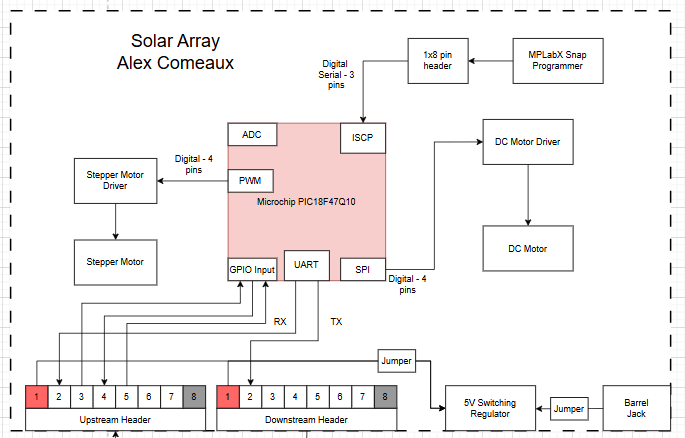

# Block Diagram

## Overview

This page contains the block diagram for my motor subsystem. The block diagram includes two motor driver blocks, one for the stepper motor and the DC motor. The DC motor is controlled by an SPI motor driver, with a wide range of command and debug capabilities. Additionally, the MCU will be equipped with a UART module. The UART will be used for upstream and downstream communication to other subsystems, as well as for receiving the motor commands and necessary movement angles.

## Decision-Making Process

At the beginning of this project, the block diagram included several other components, such as independent photoresistors, a limit switch and a second DC motor. However, after review and PCB design, I came to the conclusion that the design needed to be as simple as possible. For this reason, there is only one DC motor that spins bi-directionally, and reading off the photoresistors as well as processing the logic is done in the sensor suite subsystem. These changes have enabled our team to properly delegate the work between each subsystem.