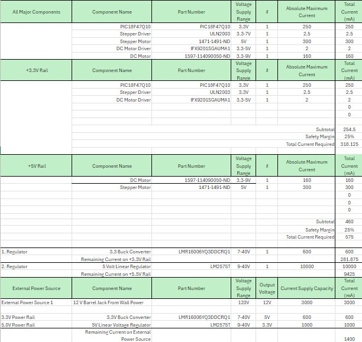
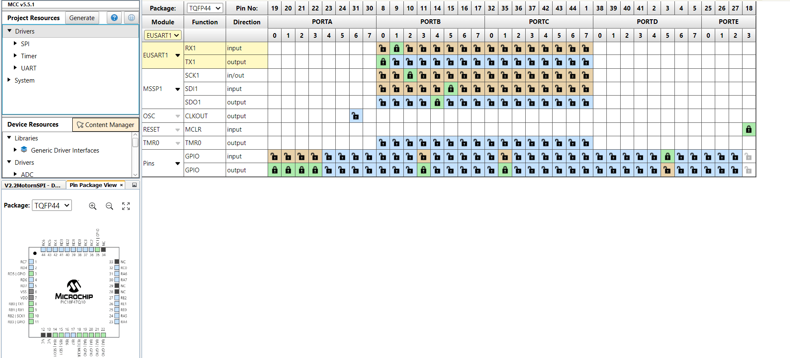

# Component Selection

## Introduction
The purpose of this project is to create an interactive and educational product for k-12 students to learn about weather and the weather cycle. In order to accomplish this, my subsystem comprises of a solar tracking array, consisting of a microcontroller, motor, motor driver, and light sensor. These components will all interface with the other subsystems and actively track either the most intense light in the environment, or track the position of the sun itself via local weather data.

## Criteria

In order for this project to be successful, there are many criteria that must be met. Most importantly, the device must be functional and functional for long enough to serve as a useful teaching tool. In order to accomplish this, parts must be selected with quality and robustness in mind. Furthermore, the budget must be taken into consideration as well. If parts get too expensive, it is easy to exceed the projected budget. But most importantly, the parts were selected with compatability in mind. If the parts struggle to interface with each other, we will create unnecessary roadblocks for our team further down the line. Overall, the criteria for each selected part included quality, cost, and compatability among other things.

# Components

## Microcontroller
### Option 1

| **Option** | **Pros** | **Cons** | **Unit Cost & Link** |
| --- | --- | --- | --- |
| **PIC16F18875**   | Multiple timers, hardware PWM, and various communication peripherals  |No WiFi/Bluetooth | $1.82 (DigiKey)(https://www.digikey.com/en/products/detail/microchip-technology/PIC16F18875-I-PT/5803538)
| |  Supports I2C  |Limited RAM compared to ESP32
| | Reliable MPLAB XC8 & MCC support  |
| | 5V operation (compatible with most motor drivers)|

### Option 2
| **Option** | **Pros** | **Cons** | **Unit Cost & Link** |
| --- | --- | --- | --- |
| **PIC18F47Q10**   | includes multiple timers, Configurable Logic Cells (CLC), ADCs, comparators, and communication modules (I2C, SPI, EUSART)  |No WiFi/Bluetooth | $2.52 (DigiKey)(https://www.digikey.com/en/products/detail/microchip-technology/PIC18F47Q10-I-P/10187785)
| |  better power management modes and improved performance  |Limited RAM compared to ESP32
| | supported by the MPLAB® Snap In-Circuit Debugger/Programmer  |
| | 5V operation (compatible with most motor drivers)|

### Option 3
| **Option** | **Pros** | **Cons** | **Unit Cost & Link** |
| --- | --- | --- | --- |
| **PIC16F877A**   | You can program and debug it via ICSP |No WiFi/Bluetooth | $1.82 (DigiKey)(https://www.digikey.com/en/products/detail/microchip-technology/PIC16F877A-I-P/446143)
| |  Very popular MCU to use, a lot of support online  |may need to write lower-level code to manage interrupts or to generate precise step timing
| | Can run on very little power  |
| | 5V operation (compatible with most motor drivers)|

## Final Selection: PIC18F47Q10 (Option 2)

#### Rationale:
The microcontroller I decided to use for this project was the PIC18F47Q10, as there is an abundance of resources and information online,  There also more examples online on how to use a stepper driver with this PIC controller than any other PIC controller. In addition to this, the microcontroller is proven to have reliable SPI connection as well as plenty of ram to control more than one motor driver. 

## Stepper Motor
### Option 1

| **Option** | **Pros** | **Cons** | **Unit Cost & Link** |
| --- | --- | --- | --- |
| **1528-1367-ND**   | Very common and widely supported by a variety of stepper drivers like the ULN2003 |Slightly expensive| $14.00 (Adafruit) (https://www.adafruit.com/product/324)
| |  Offers a good balance between torque and size/weight  |Potentially No Integrated Gearbox
| | Mid range torque  |
| | 9-12V (compatible with most motor drivers)|

### Option 2
| **Option** | **Pros** | **Cons** | **Unit Cost & Link** |
| --- | --- | --- | --- |
| **QSH4218-35-10-027**   | High Precision |Very expensive| $50.00 (Digikey) (https://www.digikey.com/en/products/detail/analog-devices-inc-maxim-integrated/QSH4218-35-10-027/4843425)
| |  Cheaper than other options | May require a gearbox
| | High torque at low voltage  | 
| | 5V operational voltage|

## Final Selection: 1528-1367-ND (Option 1)

#### Rationale:
The actuator I decided to go with for this project is option 1, the Nema 14 stepper motor. This option is the most realistic as it will be easiest to interface with a stepper driver and PIC microcontroller. Additionally, this actuator is the easiest to use in terms of precise movement.  

## Serial Communication DC Motor Driver
### Option 1

| **Option** | **Pros** | **Cons** | **Unit Cost & Link** |
| --- | --- | --- | --- |
| **IFX9201SG**   | Minimal surrounding circuitry | Only 1 motor control| $3.45 (Digikey) (https://www.digikey.com/en/products/detail/infineon-technologies/IFX9201SGAUMA1/5415542?s=N4IgTCBcDaIJIDEAaBOMAGAjAZQOIgF0BfIA)
| |  Inexpensive  | Possible heat sink needed
| | Resources available for integration  |
| | |

### Option 2
| **Option** | **Pros** | **Cons** | **Unit Cost & Link** |
| --- | --- | --- | --- |
| **DRV8830**   | Common Motor Driver  | Limited resources online| 2.09 (Digikey) (https://www.digikey.com/en/products/detail/texas-instruments/DRV8830DGQR/2520903)
| |  I2C compatability | I2C may be harder to interface than SPI
| | Simple surrounding circuitry | 
| | 5-6V operational voltage|

## Final Selection: IFX9201SG (Option 1)

#### Rationale:
The driver I decided to go with for the DC motor was option 1. This is because the surrounding circuitry is easier to set up, and there are more resources at my disposal for integration. Additionally, the motor driver is proven to be working with the PIC18F47Q10 through SPI serial communication. 

## Stepper Motor Driver
### Option 1

| **Option** | **Pros** | **Cons** | **Unit Cost & Link** |
| --- | --- | --- | --- |
| **A4988**   | Designed for bipolar stepper motors |Overheats quickly at higher currents| $4.26 (Digikey) (https://www.digikey.com/en/products/detail/allegro-microsystems/A4988SETTR-T/2237991?s=N4IgTCBcDaIIIBYCcAOFIC6BfIA) 
| |  Requires only two control signals | No reverse voltage protection 
 | | Functional with a wide range of motors  | 
| | 8-35V | 

### Option 2
| **Option** | **Pros** | **Cons** | **Unit Cost & Link** |
| --- | --- | --- | --- |
| **ULN2003**   | Can drive multiple loads |Overheats very quickly at higher currents| $.43 (Digikey) (https://www.digikey.com/en/products/detail/stmicroelectronics/ULN2003A/599603)
| |  Protects against voltage spikes from inductive loads | Designed only for unipolar motors
| | Cost effective  |
| | 6-50V |

## Final Selection: ULN2003 (Option 2)

#### Rationale:
I concluded that this driver was the most suitable for my project because most of the online resources on how to control stepper motors used this particular driver. Additionally, although it lacks reverse voltage protection, it is not difficult to implement flyback diodes. 

## Power Regulation
This project will require two seperate voltage lines, and therefore two voltage regulators. The motors pull too much current to be connected to the same line as the drivers and microcontroller. 
## 5V Line

### Option 1
| **Option** | **Pros** | **Cons** | **Unit Cost & Link** |
| --- | --- | --- | --- |
| **LM2575T Switching Regulator**   | Detailed datasheet |Only one 5v output| $1.15 (Digikey) (https://www.digikey.com/en/products/detail/advanced-photonix/PDV-P9203/480628?s=N4IgTCBcDaIAoBEBqBaOBOMAGAzCAugL5A)
| |  Simple to interface | Relatively expensive
| | Can handle high voltage in (up to 40V)  |
| 

### Option 2
| **Option** | **Pros** | **Cons** | **Unit Cost & Link** |
| --- | --- | --- | --- |
| **UA7812CKCSE3 Switching Regulator**   | Cost effective |Relatively inefficient| $.85 (Digikey) (https://www.digikey.com/en/products/detail/rochester-electronics,-llc/UA7812CKCSE3/13464984?gclsrc=aw.ds&&utm_adgroup=Integrated%20Circuits%20%28ICs%29&utm_source=google&utm_medium=cpc&utm_campaign=Shopping_DK%2BSupplier_Rochester&utm_term=&utm_content=Integrated%20Circuits%20%28ICs%29&utm_id=go_cmp-14247218536_adg-128566365520_ad-539599078936_pla-354083419805_dev-c_ext-_prd-13464984_sig-CjwKCAiAlPu9BhAjEiwA5NDSA5MPX2QTXo8NFO1wKjSwAMdMx7QoN-i5GsXDH0R884UZbLYzVt-gwxoCvdEQAvD_BwE&gad_source=1&gclid=CjwKCAiAlPu9BhAjEiwA5NDSA5MPX2QTXo8NFO1wKjSwAMdMx7QoN-i5GsXDH0R884UZbLYzVt-gwxoCvdEQAvD_BwE)
| |  Simple to interface | 
| | Can handle high voltage in (up to 24V)  |

## Final Selection: LM2575T (Option 1)

#### Rationale:
I came to the conclusion that the first option would be best, as I need a robust and easy to interface voltage regulator. The first option has a very detailed datasheet with several example application diagrams, which will streamline the power supply design process.

## 3.3V Line

### Option 1
| **Option** | **Pros** | **Cons** | **Unit Cost & Link** |
| --- | --- | --- | --- |
| **AP63203WU-7 Switching Regulator**   | 2A output current |Mildly complicated application diagram| $1.38 (Digikey) (https://www.digikey.com/en/products/detail/diodes-incorporated/AP63203WU-7/9858426?s=N4IgTCBcDaIIIAUBsBmMAGFB1AqgWgHYQBdAXyA)
| |  6-40V input voltage |Potential for switching noise
| | Inexpensive  |
| 

### Option 2
| **Option** | **Pros** | **Cons** | **Unit Cost & Link** |
| --- | --- | --- | --- |
| **1589-MP1584EN-LF-PTR-ND Buck Converter**   | Up to 3A current capacity |Complicated schematic| $1.15 (Digikey) [https://www.digikey.com/en/products/detail/advanced-photonix/PDV-P9203/480628?s=N4IgTCBcDaIAoBEBqBaOBOMAGAzCAugL5A](https://www.digikey.com/en/products/detail/monolithic-power-systems-inc/MP1584EN-LF-P/18088877)
| |  6-28V input voltage | Relatively expensive
| | Efficient  |
| 

## Final Selection: Switching Regulator (Option 1)

#### Rationale:
I ultimately decided that the switching regulator would be the best choice for this application. Not only is it reliable and cheap, it would supply more than enough amperage for the logic on the microcontroller and other drivers. 

## Final Major Components Selected:

Component Name      | Selection
--------------------|-----------------
Microcontroller     | PIC18F47Q10-I/QT  
Volatage Regulator 3.3  | AP63203WU-7  
Voltage Regulator 5.0  | LM2575  
DC Motor Driver  | IFX9201SG  
Stepper Motor Driver     | ULN2003  
Stepper Motor | 1528-1367-ND

## Power Budget
The following is the power budget for each component selected

 

 I used the power budget in order to estimate how much power the system would be pulling if it was using all of its capability at once. This way, I could plan accordingly as I designed by PCB and ordered fuses. The final current draw, 1400 mA, seems high but it would only reach this number if both motors were running at full speed. Since I knew that the system should never exceed 1400 mA, I ordered a 1.5 A fuse to protect the circuit in case of a short. 

## MCC Setup

##  Final Decision-Making Process

There were many factors that went into choosing each component that would be on the final PCB. For one, all of the motor drivers had to be compatible with the PIC MCU. I wanted to find drivers that would work without needed overly complex code. The SPI driver is a good example of this, as it requires only three lines of code to turn the motor one way or another. Additionally, there are two separate voltage regulators on this board. I did this because I found it would be more reliable to run all the logic of each chip off of one 3.3 volt line, and run the motors off their own 5 volt line, reducing the risk of current overdraw and noise. In order to meet all the project requirements, I ensured all the components were surface mount, and included a motor driver that uses a serial communication protocol to send and receive messages. 

