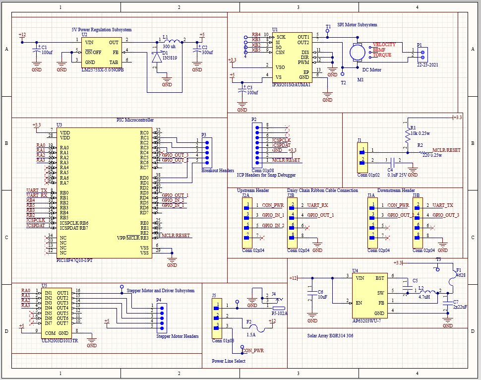
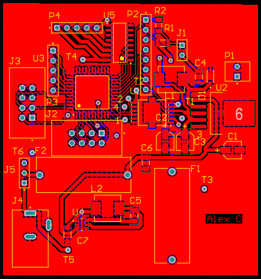
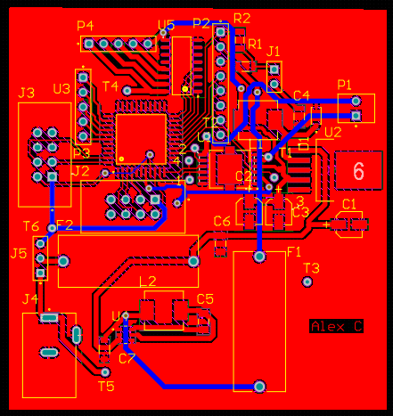

# Schematic

## Overview

This page contains the schematic diagram for this subsystem. The design of this PCB is primarily meant to accomplish two objectives. One, that it includes all the necessary requirements given to us for this class. And two, that it allows any student in the k-12 system to grasp certain concepts in both embedded systems and weather monitoring. In terms of this first objective this PCB design incorporates all the the necessary design criteria outlined in the syllabus. No daughter-boards, all surface mount components, two switching voltage regulators, and is designed to be modular with any other PCB capable of two-way UART communication. Circling back to the first objective, the whole purpose of this design is to create a smart weather station to help k-12 students understand how weather stations and other electronic devices collect and process data. The intention of this particular subsystem is to control the motors for the solar array, one to adjust the tilt angle of the panel and the other to change the angle of the base. Receiving the data from the sensor system, processing it, and then changing the angle of the base or panel given that information is a key part of how this weather station demonstrates the capabilities of modular micro-controllers.

## Schematic Image

 

## PCB Design

### Front image

### Rear image

## Hardware Design Reflection

There are several things I could have done differently in order to improve the hardware of this design. However, overall my design was a success and needed nearly zero additions to enable functionality. There was only one minor mistake made in terms of the schematic design, in that for the 3.3 volt regulator I was missing a capacitor in series with C7. This was a simple fix. Other than that, I believe that if I had better organized the pinout of the PIC, I could have fit all of the components on one single layer, reducing the potential manufacturing cost. More than this, I most definitely could have included more test points. A lack of test points proved to be annoying, to say the least. In the end, this schematic design proved to be pretty functional and easy to integrate with the other subsystems on the team.

